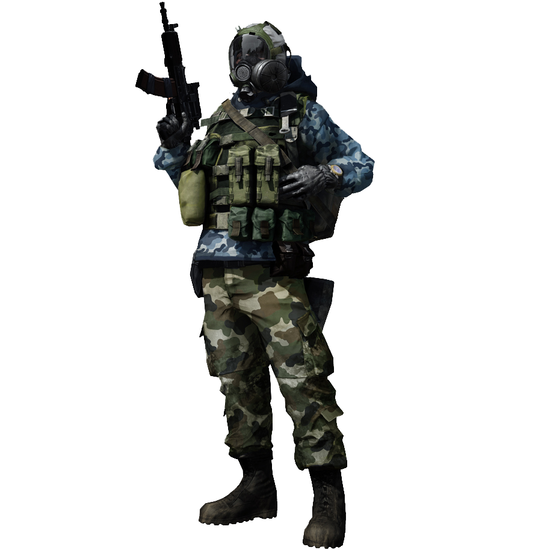

# 逃离塔科夫作弊（2023年不被检测）

此存储库包含一个逃离塔科夫游戏的作弊工具，旨在保持在2023年游戏开发人员不被检测到。请记住，使用作弊可能会导致帐户封禁，对其他玩家的游戏体验产生负面影响。请自行承担风险使用此作弊工具。

## 安装

要安装此作弊工具，请按照以下步骤进行操作：

1. 从此存储库下载作弊工具文件。

2. 从下载的RAR存档中提取文件。存档的密码是“EFT2023”。

3. 运行“inject.exe”将作弊工具注入游戏中。

4. 启动逃离塔科夫游戏。

## 使用

要使用此作弊工具，请按照以下步骤进行操作：

1. 确保作弊工具正在运行并已注入游戏中，如“安装”部分所述。

2. 在游戏中，使用作弊工具界面中指定的热键来激活各种功能。

3. 享受在逃离塔科夫游戏中的作弊工具的优势。

## 声明

在游戏中使用作弊和黑客工具可能会违反游戏的规则和许可，并可能导致帐户封禁。此存储库的作者对使用此作弊工具的任何后果概不负责。

## 依赖关系

作弊工具可能需要额外的软件依赖项。确保您已满足作弊工具文档中指定的所有要求。

## 贡献

如果您对此作弊工具有建议或改进意见，可以通过创建新的拉取请求来提出。但是，请记住，使用作弊可能会违反游戏的规则。

## 许可

此存储库和提供的作弊工具按“原样”提供，没有任何担保。请自行承担风险使用它们。
